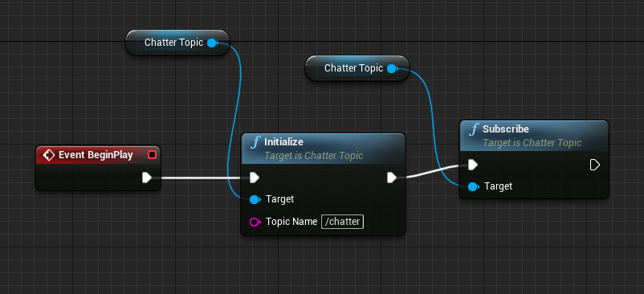
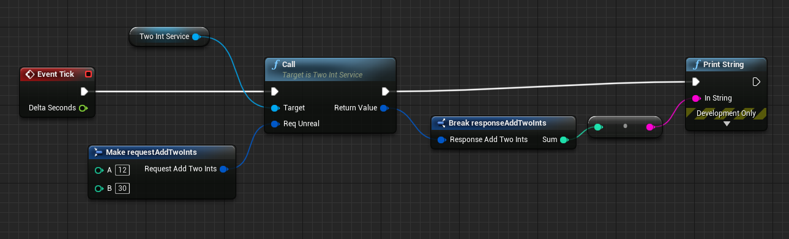

#  ROS4Unreal

[![Release][Release-Image]][Release-Url]  

ROS4Unreal is a Unreal Engine plugin for communications with ROS thanks to ROSBridge. 


***
# How to include in a Unreal Engine Project
1. If you not have [your_project_name]/Plugins : 
    - create an empty folder Plugins

1. In the plugins folder of your project clone this repo 
```
git clone https://github.com/RIS-WITH/ROS4Unreal.git
```
***
# Examples
Examples use topic and service define in ROS tutorials (chatter/Add Two Ints)
## C++
Thing to have a C++ project or to add a c++ classes before use this.
### Topic

#### Initialization
Create an actor in unreal engine [myActor]

in myActor.h
```cpp
UchatterTopic* topic_client;
```
in myActor.cpp
```cpp
// Sets default values
AmyActor::AmyActor()
{
 	// Set this actor to call Tick() every frame.  You can turn this off to improve performance if you don't need it.
	PrimaryActorTick.bCanEverTick = true;
	topic_client = CreateDefaultSubobject<UchatterTopic>("listener");
}
// Called when the game starts or when spawned
void AClientExamples::BeginPlay()
{
	Super::BeginPlay();
	topic_client->initialize("/chatter1");
	
}

```
#### Subscribe
in myActor.cpp
```cpp
void chatterCallback(const chatterMessage_t & msg) {
	
	UE_LOG(LogTemp, Warning, TEXT("Message receive in the callback for subscribe : %s"), *string2Fstring(msg.data));
}


// Called when the game starts or when spawned
void AClientExamples::BeginPlay()
{
    ...
    topic_client->subscribe(chatterCallback);
	...
}

```


#### publish

### Service

#### Initialization
Create an actor in unreal engine [myActor]

in myActor.h
```cpp
UtwoIntService* service_client;
```
in myActor.cpp
```cpp
// Sets default values
AmyActor::AmyActor()
{
 	// Set this actor to call Tick() every frame.  You can turn this off to improve performance if you don't need it.
	PrimaryActorTick.bCanEverTick = true;
	service_client = CreateDefaultSubobject<UtwoIntService>("clientTwoInts");
}
// Called when the game starts or when spawned
void AClientExamples::BeginPlay()
{
	Super::BeginPlay();
	service_client->initialize("/add_two_ints");
	
}

```
#### Call Service 
```cpp
// Called every frame
void AClientExamples::Tick(float DeltaTime)
{
	Super::Tick(DeltaTime);
	requestAddTwoInts_t req;
	req.a = 12;
	req.b = 30;
	responseAddTwoInts_t res;
	if (service_client->call(req, res)) {
		UE_LOG(LogTemp, Warning, TEXT("RESPONSE : ---- %d"), res.sum);
	}
	else {
		UE_LOG(LogTemp, Warning, TEXT("Call dropout"));
	}

}
```

## Blueprint

### Topic

#### Initialization and Subscribe



#### Event on subscribe


### Service

#### Initialization


#### Call Service 



[Tutorials to create Custom Topic or Service](docs/tutorials/CustomServiceTopic.md)


[Release-Url]: https://github.com/RIS-WITH/ROS4Unreal
[Release-image]: http://img.shields.io/badge/release-v0.1.0-1eb0fc.svg